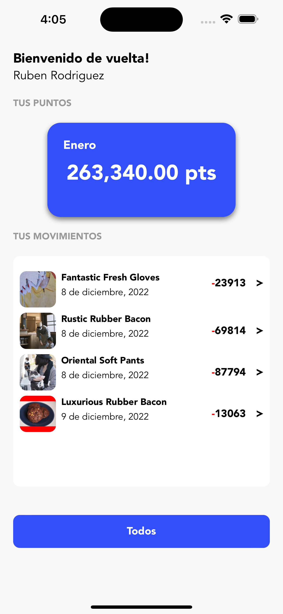

## Products Points App

This is a simple app that allows you to show your products and points to your customers.

### How to use

1. Clone this repository
2. Run `yarn install && npx pod-install` to install all dependencies
3. Run `yarn ios` to start the app

### Demo

    

### Screenshots

    
    

    
    

